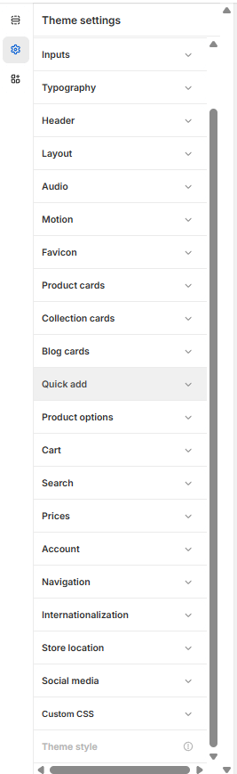

# Quick add

Quick add allows customers to add products to their cart directly from product cards without having to visit the product page. This feature can streamline the shopping experience and increase conversion rates by reducing friction in the purchase process.

### FAQs

Where can I adjust my quick add settings?

1. **Navigate to Theme settings > Quick Add** - Open your theme by clicking **Customize**
2. Click the **gear icon** (⚙️) in the top-left corner to open **Theme Settings**
3. Scroll down and select **Quick Add**
4. Modify your quick add settings (button style, position, behavior, etc.) as needed
5. Click **Save** to apply your changes

<figure><figcaption></figcaption></figure>

### Quick add settings

| Setting                     | Description                                                                                                                                                                                         |
| --------------------------- | --------------------------------------------------------------------------------------------------------------------------------------------------------------------------------------------------- |
| Enable quick add on mobile  | Controls whether the quick add feature is available on mobile devices. When enabled, mobile users can quickly add products to their cart from product listings without visiting the product page.   |
| Enable quick add on desktop | Controls whether the quick add feature is available on desktop devices. When enabled, desktop users can quickly add products to their cart from product listings without visiting the product page. |
