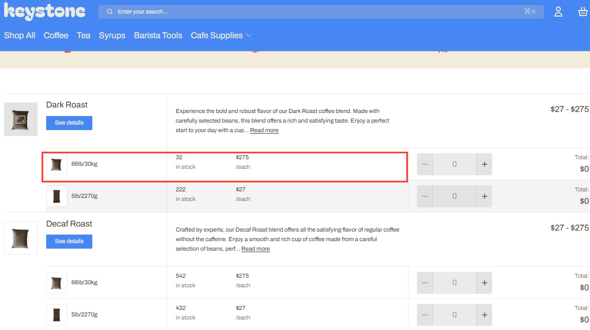

# Custom content for tables

## Displaying metafield content in product tables

Using metafields, you can display custom data within your product table. This allows for enhanced product comparisons and detailed information display. Display SKU's, product id's, or any other additional product information within the table!&#x20;

Available in Keystone 1.3.0+

**Add custom data to tables via Theme settings**



#### Open the theme editor

In Shopify, go to Online Store > Themes and click **Customize** on the theme you want to update.



#### Navigate to Product cards

In the left panel, open **Theme settings > Product cards**.



#### Configure Table details

Scroll to the bottom to find **Table details** (Keystone 1.3.0+). Add the metafield(s) you want to display in your product tables. Supports both product and variant metafields (e.g., `custom.weight`).



#### Save and preview

Click **Save**, then preview a page with a product table to confirm your custom data appears.



<figure><figcaption></figcaption></figure>

**Create your metafields in Shopify**



#### Add a product metafield definition

In your Shopify admin, go to **Settings > Custom data > Products**, then click **Add definition**. For example, create a definition for **Weight** with namespace and key like `custom.weight` and choose an appropriate type (e.g., Multi-line text).



#### (Optional) Create a metaobject definition

If you want to manage richer structured content, create a **Metaobject** in **Settings > Custom data > Metaobjects** and relate it via a metafield.



#### Assign data to products

Open a product in the Shopify admin, scroll to **Metafields**, and enter values for the metafield(s) you created.



**Display custom data in the Product Comparison section**



#### Add a Metafield block

In the theme editor, open a page that uses the **Product Comparison** section. Click **Add block** and select **Metafield**.



#### Choose which metafield to show

In the block settings, select the product or variant metafield (e.g., `custom.weight`) to display within the table.



#### Save

Click **Save** and verify the table shows your custom data.


