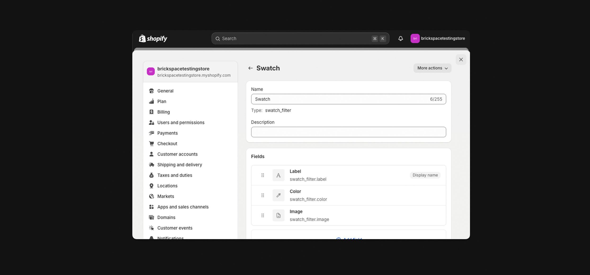
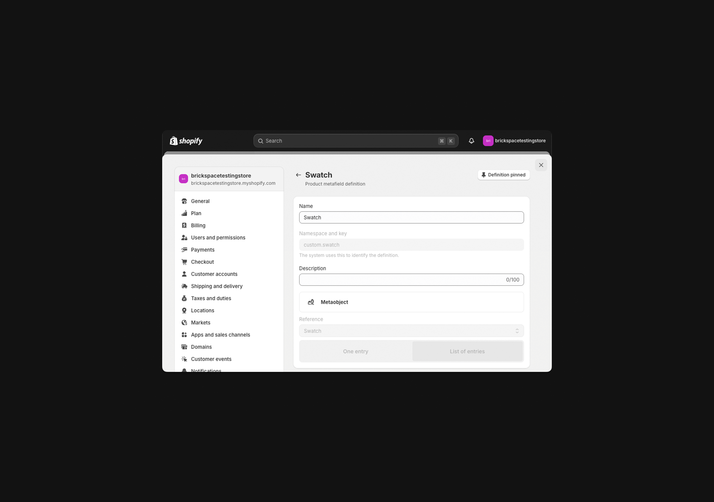

---
layout:
  title:
    visible: true
  description:
    visible: true
  tableOfContents:
    visible: true
  outline:
    visible: true
  pagination:
    visible: true
---

# Variant filtering

Your collection page filtering can be customized from the [Shopify Search and Discovery app](https://apps.shopify.com/search-and-discovery). Using this app you can add new filters and customize how they appear on your theme.

Shopify has recently made a number of improvements to metafields and how they work with swatches. This is great news for us because now swatches are much easier to manage and update.


### Add swatch filter from metafield <a href="#h_4f300afd17" id="h_4f300afd17"></a>



### Add swatch filter from metafield <a href="#h_4f300afd17" id="h_4f300afd17"></a>

1. Go to **Settings** > **Custom Data**
2. Scroll down to **Metaobject** definitions then click **Add definition**
3. Add a name and description to your metaobject
   * You can use any name or description. E.g. "Swatch"
4.  Add three fields to your metaobject

    * Label, color and image.
    * Label should be a required field using "Single line text" - Make sure to select "List of values" after clicking single line text.
    * Color is not required and uses "Color".
    * Image is not required and uses "File" with "Accepts specific file types - Images" selected.


    <figure><figcaption></figcaption></figure>



### Create metafield to link to metaobject

We now have to assign values so data is populated for our new metafields.

1. Go to **Settings** > **Custom** **data**
2. Click **Product**
3. Select **Add definition**
4. Add a name and description to your new metafield.
   * You can use any name or description. E.g. "Swatch"
5. Click **Select type** then pick **Metaobject**
6. Choose **List of values**
7. In the reference field enter the Metaobject you have just created
8. Assign values to each product
9. Hit **Save**

<figure><figcaption></figcaption></figure>



### Link metafields to products

1. Find a product you want to update
2. Scroll down to **Product metafields**&#x20;
3. Add the colors you'd like to highlight for this product



### Connect to filter

1. Open the [**Search and discovery app**](https://apps.shopify.com/search-and-discovery)
2. Navigate to **Filters**&#x20;
3. Click **Add filter**
4. Click **Select source,** then look for the new product metafield you just created
5. Add a label
   * You can use any name or description. E.g. "Color" or "Material"
6. Click **Save**




### Add swatch filter from 'Color' option <a href="#h_c284ce1b06" id="h_c284ce1b06"></a>


You can add filters using color product options. This is a easy way to add filters but will require swatch files to be uploaded in a specific format. Swatches will only appear using this approach when the product option matches "color" - or a translation of color.



1. Open the [**Search and discovery app**](https://apps.shopify.com/search-and-discovery)
2. Navigate to **Filters** and click **Add** **filter**
3. Click **Select source** then look for the product option **Color**


This is the same approach you would take if you wanted to filter by any other product option like size.


4. Add a **label**
   1. You can use any name or description. E.g. "Color"
5. Hit **Save**


### Caveats of metafield filtering

If you use metafield swatch filtering you'll have to ensure you update your metafields for all products that you want to appear on this filter - this will NOT happen automatically even if category metafields and variant options are displaying swatches.


### &#x20;A temporary fix for adjusting color swatch sizing <a href="#h_9af1582f1b" id="h_9af1582f1b"></a>

1. Go to **Online Store** > **Theme settings** > **Custom css**
2.  Within your custom css block paste the following code:\
    ​\
    &#x200B;_&#x46;or color swatches/custom swatches_ (adjust the REM within height and width in increments of .1 for the best results) :

    ```
    .btn.btn--plain {
      height: 2.2rem;
      width: 2.2rem;
    }
    ```

**Upload missing swatch files**

You may notice that not all of your color filters are appearing with swatches. If this is the case you may have to upload custom swatch files.

Swatches will only appear automatically if the color name matches a default [CSS color](https://help.brickspacelab.com/en/articles/9939903-paper-using-color-and-option-swatches).

1. Identify all swatches that are missing
2. Upload a 64x64 jpg file for each swatch you want to replace.
   * Swatches must be named all lowercase and prepended with “swatch-”. For example, if your color variant is “Electric blue” you would name your file “swatch-electric-blue.jpg

<figure><figcaption></figcaption></figure>
