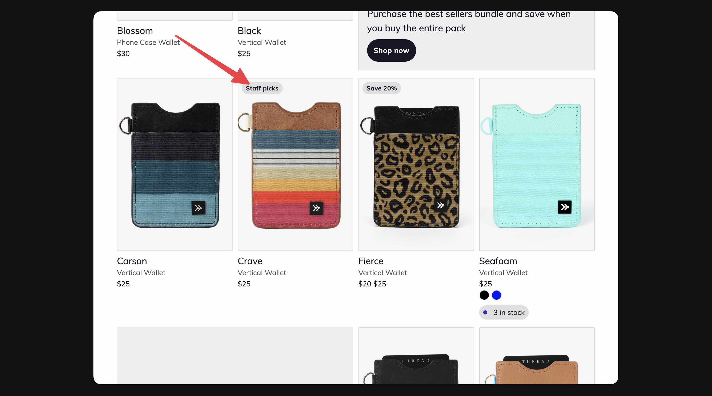

# Product badges

Product badges can be used to highlight key information about products. Badges can help customers make decisions about what products they want to explore more.

<figure><figcaption></figcaption></figure>



Open the product you’d like to update in Shopify




Scroll down to **Tags**




Enter “badge\_Your badge text”

* _Your badge text_ could be replaced with any text you want



Click **Save**





Tags can also be updated using third-party apps, the bulk editor, or even the csv product import feature


\
