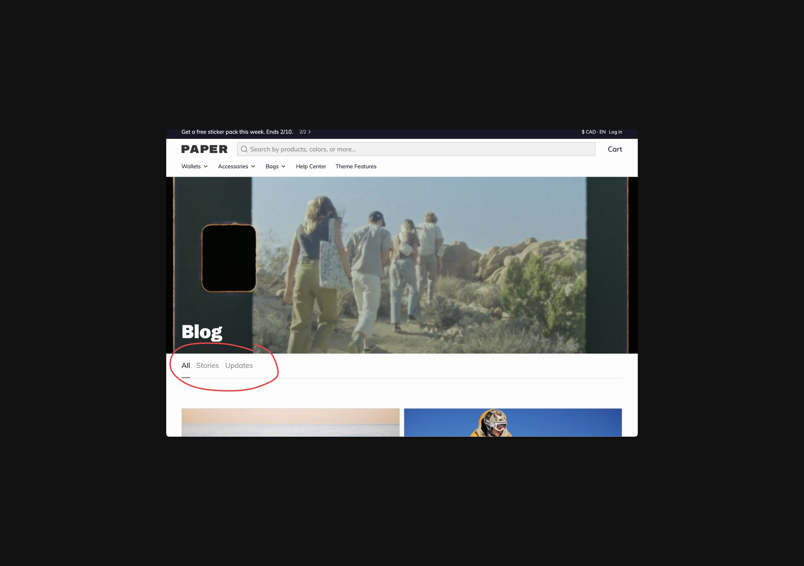

# Blog tag filtering

Using Paper you can update blog template to use tag based filtering. This is an easy way to surface sub-categories within a blog. For example, you may can show filters to view blogs posts with specific tags

<figure><figcaption></figcaption></figure>



### Create metafield definitions

1. Open up **Settings** > **Custom data**
2. Click **Blogs**
3. Click **Add** **definition**
4. Set **Name** to **Subtags**
5. Set **Namespace** and key to "custom.subtags"
6. Click **Select** content type
7. Click **Single line text**
8. Click **List of values**
9. Hit **Save**



### Add data to collection metafield

1. Go to **Online** **Store** > **Blog** **posts** > **Manage** **blogs**
2. Scroll to the bottom **Metafields** area
3. Enter a text value for each tag filter
   * There's no need to include "All" as that will be the first link within tag filtering
   * Each entry should match a tag that is present within your collection
4. Hit **Save**


