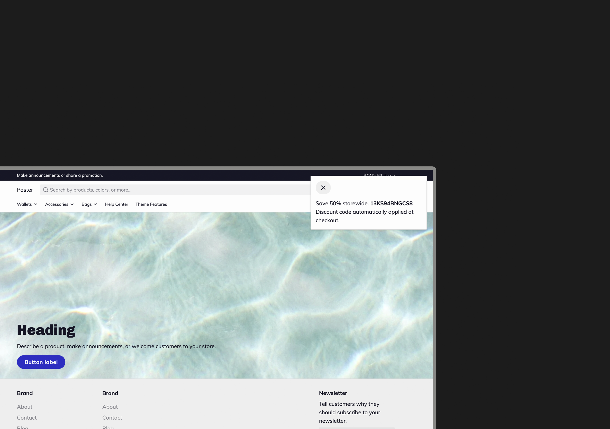

# Dynamic discount popups

If you're already using automatic discounts. This is a neat little feature to ensure customers are aware of the discounts being applied to their cart. Take your automatic discount URL and append "?dt=Custom+text" to change the content that appears in the popup.

This will display a popup with your discount and the "Custom text" message

<figure><figcaption></figcaption></figure>



In Admin, go to **Discounts** Shopify find the discount you want to share



Click into the discount you want to share



Click **Promote** > **Get a shareable link** > **Copy link**



Add "?dt=Custom+text" to the end of the link

* For example if you want to add "Save 10% storewide" to your popup your shareable link should look like this:&#x20;
  * `https://paperthemedemo2.myshopify.com/discount/SAVE10?dt=Save+10%25+storewide`
* If you're using the `?redirect=` option in your discount URL you'll want to add the custom URL text like this:&#x20;
  * `https://paperthemedemo2.myshopify.com/discount/SAVE10?redirect=%2Fcollections%2Fwallets&dt=Save+10%25+storewide`



Use the link for Promotions



\
