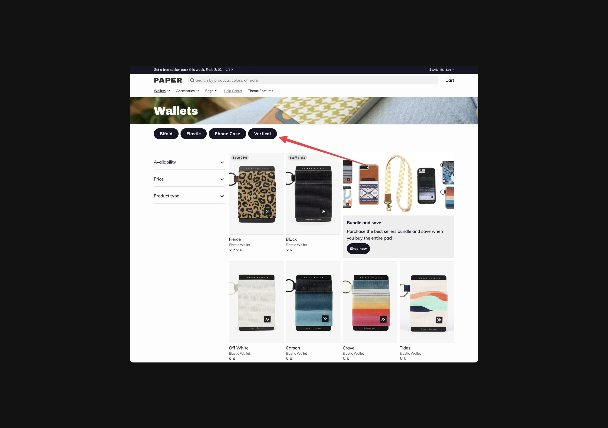

---
layout:
  title:
    visible: true
  description:
    visible: true
  tableOfContents:
    visible: true
  outline:
    visible: true
  pagination:
    visible: true
---

# Collection template

## Customizing filters for your collection template 

Collection templates in Paper are compatible with Shopify's official [Search & Discovery](https://apps.shopify.com/search-and-discovery) app. This app can be used to customize and extend the available filters for your store.



### Enable collection filters

1. Go to **Online Store** > **Themes** > **Customize**
2. From the dropdown in the center of the top bar select **Collections** > **Default** **collection**
3. On the left hand side, select **Collection grid** in the theme sections
4. Scroll down under **Display** and check **Enable filter**



### Enable collection sorting

1. Go to **Online Store** > **Themes** > **Customize**
2. From the dropdown in the center of the top bar select **Collections** > **Default** **collection**
3. On the left hand side, select **Collection grid** in the theme sections
4. Scroll down under **Display** and check **Enable sort**



### Customizing filtering options

1. Go to the [Search & Discovery](https://apps.shopify.com/search-and-discovery) app to adjust filters
2. Hit **Save**



## Adding tag filtering to a collection page 

Using Paper you can update collection template to use tag based filtering. This is an easy way to surface sub-categories within a collection. For example, you may have a collection titled Accessories using nested navigation you could then set up links to Wallets, Phone Cases, and Bags.

In this example clicking "Wallets" would filter the current collection to only show products that contain the tag "wallets".

<figure><figcaption></figcaption></figure>



### Create metafield definitions

1. Click **Collections** then click **Add** **definition**
2. Set **Name** to **Subtags**
3. Set **Namespace** and key to `custom.subtags`
4. Click **Select content type** and select **Single line text**
5. Click **List of values**
6. Hit **Save**



### Add data to collection metafield

1. Open the collection you’d like to add a tag filtering too
2. Scroll to the bottom **Metafields** area.
3. Enter a text value for each tag filter
   * There's no need to include "All" as that will be the first link within tag filtering
   * Each entry should match a tag that is present within your collection
4. Hit **Save**



## Adding a nested menu to a collection 

Each collection can be set up with nested navigation. This is useful if you have a large collection with multiple sub-groupings within. For example, you may have a collection titled Accessories using nested navigation you could then set up links to Wallets, Phone Cases, and Bags.

In this example clicking "Elastic" would navigate to a new page loading the "Elastic" collection page.

<figure><figcaption></figcaption></figure>



### Create metafields definitions

1. Go to **Settings** > **Metafields**
2. Click **Collections** then click **Add definition**
3. Set **Name** to **Subcollections**
4. Set **Namespace** and key to `my_fields.subcollections`.
5. Click **Select content type** and choose **Single line text**
6. Click **Save**



### Add data to Collection metafield

1. Open the collection you’d like to add a tag filtering too
2. Scroll to the bottom **Metafields** area
3. Enter a text value for each tag filter
   * There's no need to include "All" as that will be the first link within tag filtering
   * Each entry should match a tag that is present within your collection
   * This text must be formatted in a specific way. Please ensure each menu item is separated by “&” then ensure each title and url for each item is separated by a “,”.
   * It should look something like this:
     * <pre><code><strong>Tops,/collections/tops&#x26;Bags,/collections/bags&#x26;Shorts,/collections/short
       </strong></code></pre>
4. Click **Save**



## Adding blocks to a collection grid 

The collection template can include optional blocks. These blocks are displayed in-grid alongside your products. This can be used to display a text block or a newsletter. Both of which are great for highlighting ongoing promotions

<figure><figcaption></figcaption></figure>



Go to **Online Store** > **Themes** > **Customize**



From the dropdown in the center of the top bar select **Collections** > **Default collection**



Select **Collection grid** from the theme sections



Click **Add Block** then select either **Newsletter** or **Content**.



Click into the newly created block



For the Index field enter the number position you want to display within the collection grid.

* Entering 1 will ensure this block is displayed as the first item in your grid.



Update the content of your block as needed



Hit **Save**



\
