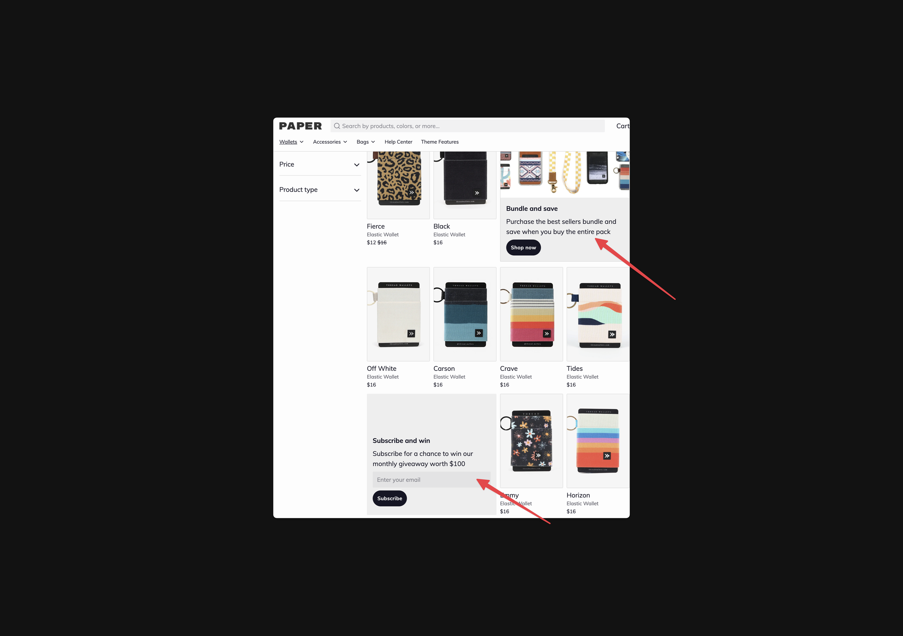

---
layout:
  title:
    visible: true
  description:
    visible: true
  tableOfContents:
    visible: true
  outline:
    visible: true
  pagination:
    visible: true
---

# Collection template

## Adding blocks to a collection grid 

The collection template can include optional blocks. These blocks are displayed in-grid alongside your products. This can be used to display a text block or a newsletter. Both of which are great for highlighting ongoing promotions

<figure><figcaption></figcaption></figure>



Go to **Online Store** > **Themes** > **Customize**



From the dropdown in the center of the top bar select **Collections** > **Default collection**



Select **Collection grid** from the theme sections



Click **Add Block** then select either **Newsletter** or **Content**.



Click into the newly created block



For the Index field enter the number position you want to display within the collection grid.

* Entering 1 will ensure this block is displayed as the first item in your grid.



Update the content of your block as needed



Hit **Save**



\
