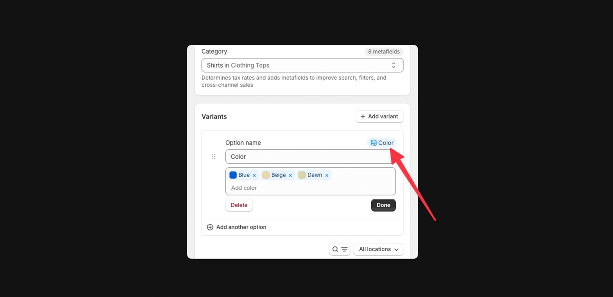

# Variant swatches

Swatches are used to make variant selections easier and more intuitive for customers when they are selecting an option with color. Swatches appear throughout your theme in various places and can be used with custom images or hex code colors.

<figure><figcaption></figcaption></figure>

In order to display swatches on a product page or within a product card we can use metafield connected variant options. This might sound complicated but it's super easy to setup and works great out of the box.



Go to the product you want to update



Scroll to **Category**



Select the Category of your Product



Scroll to **Variants**



Click **Add variant**



Add a new option like Color or Material



Right of Option name, click matching metafield

eg. "Color" or "Material"

<figure><figcaption></figcaption></figure>



Enter Swatch names


From here you'll be able to change the hexcode or image of each swatch by clicking into it.




Hit **Save**


